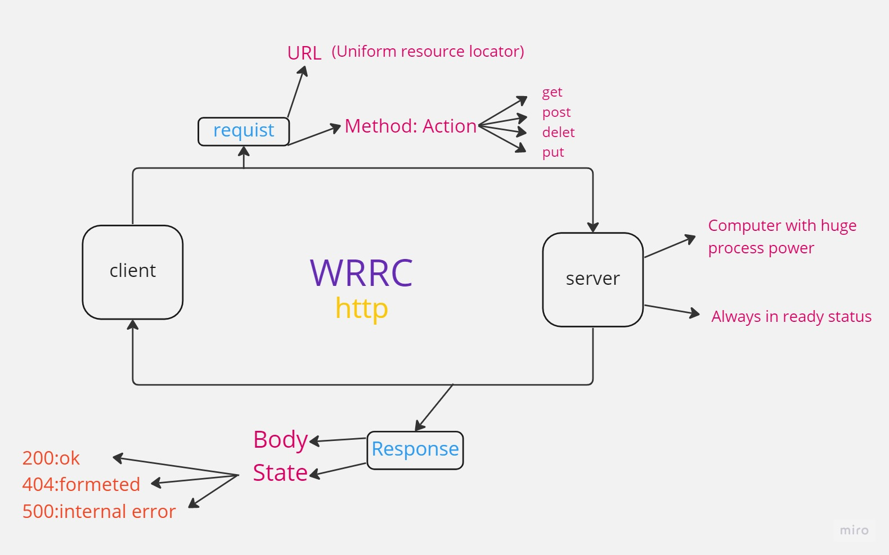
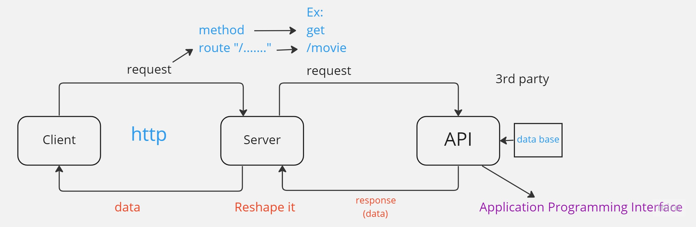

# Movies-Library
# Project Name: Movies Library - Project Version: v1

**Author Name**: Mo'ath Ahmad

## WRRC

## Overview

## Getting Started
1-Download node.js  
2-init -y  
3-create `index.js` 
4-`npm install express` 
5-`npm i cores` 
6-`npm i nodemon` 
7-`npm i auxios` 
<!-- What are the steps that a user must take in order to build this app on their own machine and get it running? -->

## Project Features
<!-- What are the features included in you app -->
This app allow you to check the trending movies  
search any movie by it's name,
choose  movie depend on its genre,
and showing the upComing movies.